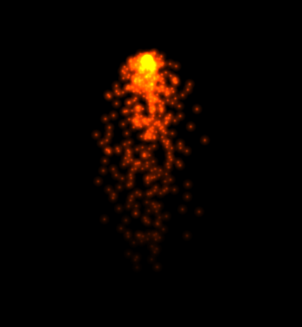

## Particle emitter
basic particle emitter with the purpose of learning a bit about 
OpenGL compute shaders



Dependencies:
* meson
* GLFW
* OpenGL/GLEW
* GLM 
* stb image loader

Build and run:

```
$ meson setup build
$ cd build
$ ninja
$ ./emitter
```

WASD to move camera  
Mouse to change camera direction  
Mouse wheel to zoom  
Space bar to leave camera mode  
